# **MLM-USE Developer Guide**

# Table of Contents

1. [Introduction](#1-introduction)
2. [Parsing Rules](#2-parsing-rules)
3. [AST Classes](#3-ast-classes)
4. [M Classes](#4-m-classes)
5. [The Multi-Model](#5-the-multi-model)
   1. [Naming Convention - ‘@’](#51-naming-convention)
   2. [Parsing Rules That Were Added](#52-parsing-rules-that-were-added)
   3. [AST Classes That Were Added](#53-ast-classes-that-were-added)
   4. [New Multi M Classes](#54-new-multi-m-classes)
   5. [Testing of Multi-Model](#55-testing-of-multi-model)
6. [The Multi-Level-Model](#6-the-multi-level-model)
   1. [Parsing Rules That Were Added](#61-parsing-rules-that-were-added)
   2. [AST Classes That Were Added](#62-ast-classes-that-were-added)
   3. [M Classes That Were Added](#63-m-classes-that-were-added)
   4. [Testing of MLM](#64-testing-of-mlm)
   5. [System analysis support: static analysis [TODO]](#65-system-analysis-support-static-analysis-todo)
7. [Miscellaneous](#7-miscellaneous)
   1. [How to Release a New Version](#71-how-to-release-a-new-version)
   2. [Model Validator Plugin](#72-model-validator-plugin)
   3. [How to Add Plugins to Dev Environment](#73-how-to-add-plugins-to-dev-environment)

# 1. Introduction:

In this document, we will attempt to explain the way MLM-USE works,

USE has 2 main components: 

  - use-GUI 

  - use-core

The use-gui is responsible for providing an interface to interact with the use core functions. There are 2 ways to interact: the GUI and the CLI

- GUI (graphical user interface) is built using the Java Swing library and provides a visual interface to interact with and view USE.
- The CLI (command-line interface) provides some of the features available through the GUI and some additional ones.

The use-core component handles the logic for parsing and analyzing UML files.

# 2. Parsing Rules:
When receiving a file, USE first tries to parse it using the parsing rules located in USEBase.gpart. The syntax of .gpart files is quite tricky, but with enough examples, you should be able to understand.

Let’s look at an example of parsing a regular model:

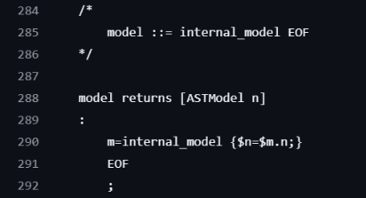

At first, we have a comment explaining the parsing rule, which in this case simply states that we call another parsing rule called internal\_model and a parsing rule that parses the EOF (end of file) character. Some parsing rules can return a java object, while others do not. In this example, the “model” parsing rule returns a java object called ASTModel (take note of that tricky syntax: the result of the “internal\_model” parsing rule is saved in a variable called ‘m’, and in the curly bracket is being set to the ‘n’ variable which was declared in line 288)

Let's look at a more complex parsing rule:

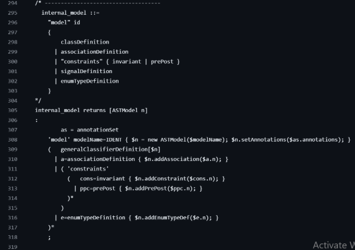

Again we see that first, we have a comment explaining what the parsing rule does, and then the parsing rule itself,

What this parsing rule does is parse the string “model” and then an identifier, and then it can parse either a class, an association, or a constraint, etc.

each line has a parsing rule and an action associated with it, for example on line 308 we specify that we want to parse the string ‘model’ then using a different parsing rule called IDENT we parse the model name and save it to a variable named ‘modelName’ that is the parsing rule part, and in the curly brackets we have the action that will be performed after, which in this case is creating a new ASTModel object and saving it to the variable ‘n’

### ANTLR 
Behind the scenes during the build process of the project, Maven, with the help of the ANTLR library, generates Java classes that handle the logic for parsing the text file into AST Java classes. The way that ANTLR does that is not important to us.

# 3. AST Classes
After the parsing is done, we are left with AST classes that contain information about the model.

The main class is ASTModel.java, which has variables for ASTClass, ASTAssociation, and many more. The class is built periodically, where each new element is added to the list.

After the parsing is done, the AST class is built, and the next step is to call its gen function, which recursively calls the gen function of all its children.

The result of the gen function of an AST class is an M class, so for ASTModel, the gen function will return MModel, and for ASTClass, the gen function will return MClass

Partial diagram of some of the AST Classes:

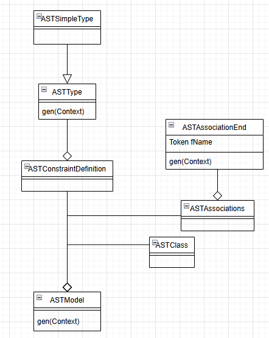

# 4. M Classes
The final classes that represent the parsed model

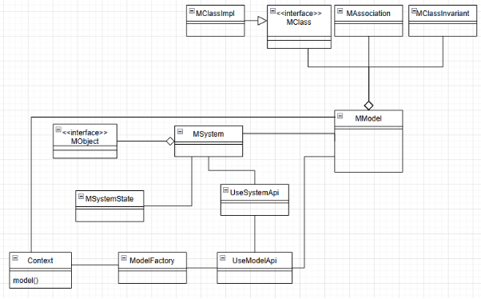

Partial diagram showing important M classes.

Important classes explanation:

**Context.java:**

used as part of the parsing process in the generation of M classes from AST classes, uses ModelFactory.java to create the new instances of the necessary M classes.

**MModel.java:**

The main component, which holds the information about the parsed model, holds lists of MClass.java, MAssociation.java, MClassInvariant.java, and more.

**generalization graph data structure:**

MModel has a data structure called fGenGraph, which is a directed graph that stores the inheritance relation between classes, the MClasses are the nodes, and an MGeneralization is the edge.

**MSystem.java & MSystemState.java:**

These classes are responsible for maintaining objects and links within an object diagram as well as for validating the satisfiability of an object diagram.

**UseModelApi.java and UseSystemApi.java:**

These are helper classes that ease the creation process of new models and object diagrams; they do not require a use file and instead create the model directly.

These classes are used exclusively for testing. 
# 5. The Multi-Model
Now you should have a rough understanding of how USE works. When we first started on this project, the first step was to add support for loading several models into USE at once. This led to the idea of having a new class called MMultiModel, which would inherit from MModel and also aggregate it, so that we could take advantage of USE’s already existing features for inter-associations and inter-constraints.

## 5.1. Naming Convention
Because in USE every element has to have a unique name, if there were two classes with the same name in different models this would cause an error, so we decided that for internal classes and associations, a prefix would be added to their name, the prefix is the name of the model and an ‘@’ sign

## 5.2. Parsing rules that were added: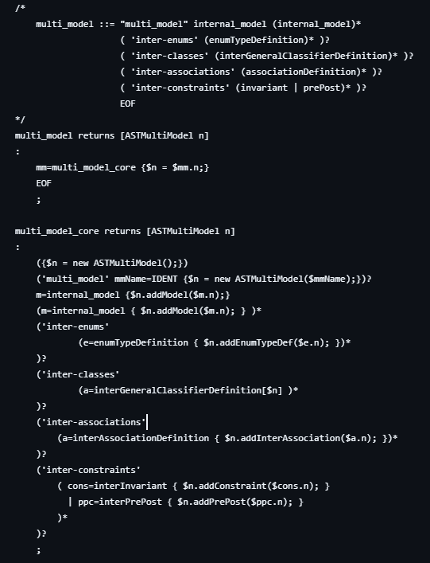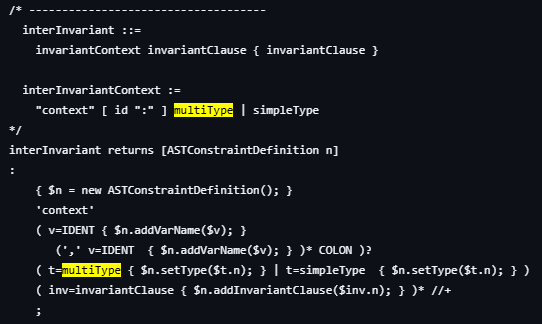

## 5.3. AST Classes that were added:
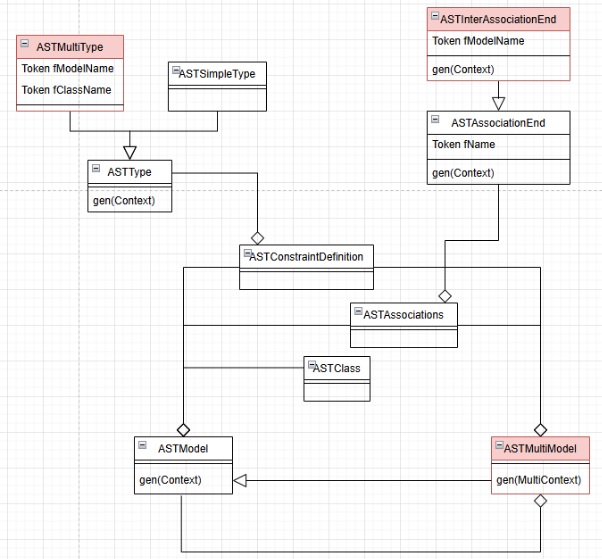

**ASTMultiModel.java:**

The most important class that was added, its gen process involves first generating every one of its models and in the end, generating the inter-association and inter-constraints.

**ASTMultiType:**

When parsing OCL inter-constraints, referencing classes from an internal model requires you to use the naming convention with the ‘@’ sign, so a new type was added to support that.

**ASTInterAssociationName:**

Needed for parsing inter-associations.

## 5.4 New Multi M Classes

**MultiContext:**

To aid the generation process of the ASTMultiModel, a “MultiContext” Class was created. We created this class because each of the internal models has to have its own Context when generating it. Thus, the MultiModel has a MultiContext, and each of the internal models also has a MultiContext that points to the main MultiContext.

**MultiModelFactory:**

MultiContext holds a MultiModelFactory instead of a ModelFactory; one of the reasons this is done is to create elements with the correct name (because now we need to take the ‘@’ into account)

**MInternalModel:**

We created a new class called MInternalModel, which overrides some methods to properly handle the naming convention.

**MInternalClassImpl:**

was created to override the method nameAsRoleName

**parsing and generation process:**

For each internal model, we first parse and generate it using the existing classes in USE. After the model is generated, we add the model to the MMultiModel 

gen graph data structure - each one of the internal models has its own gen graph, so when they are added to the multi-model, their gen graph is added to the gen graph of the multi-model.

**Object diagram of a multi-model:**

Since a multi-model is a model, there was no need for any modifications to the object diagram

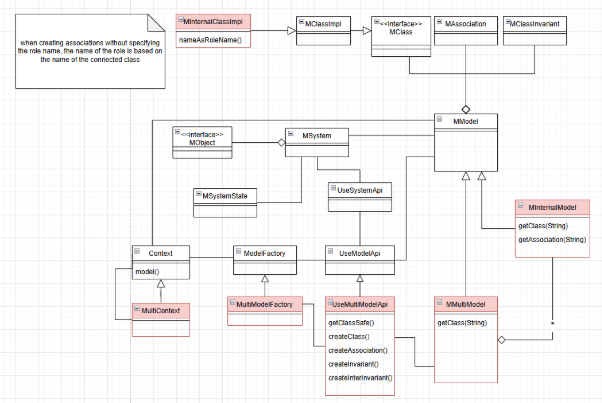

## 5.5. Testing of Multi-Model
Testing is done in the following classes:

- MultiModelCreationTest.java
- MultiModelObjectCreationTest.java
- MultiModelPropertiesTest.java
- SoilCompilerMultiTest.java
- USECompilerMultiTest.java

# 6. The Multi-Level-Model
An MLM is a multi-model where the models are ordered into levels, with extra elements called Mediators; a mediator can add additional relationships between 2 models of adjacent levels.

## 6.1. Parsing rules that were added:
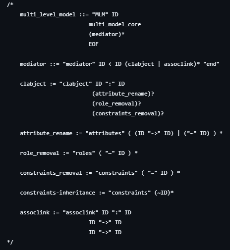
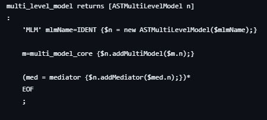
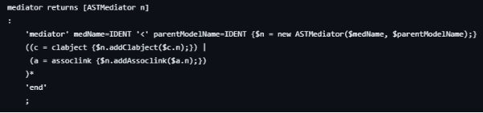
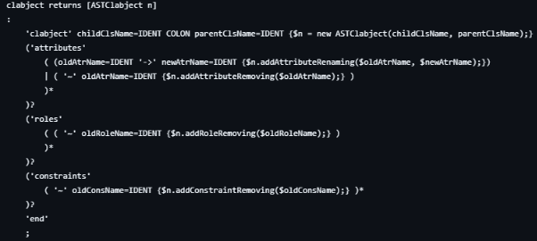
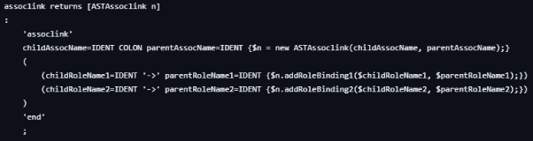

##  6.2. AST Classes that were added:
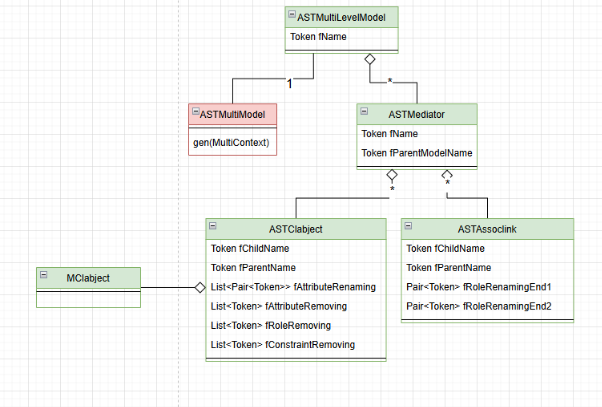

## 6.3. M Classes that were added:
**MLMContext:**

when parsing an MLM we first parse the models as part of a multi-model, the next step is to prase the Mediators, each mediator has access to the model of its level and the model of the level above it, so for each mediator, we must keep track of 2 contexts as well as the main context.

**MMultiLevelModel:**

**MMediator:**

As the name suggests, the mediator mediates between 2 models and applies a hierarchy of instantiation between them

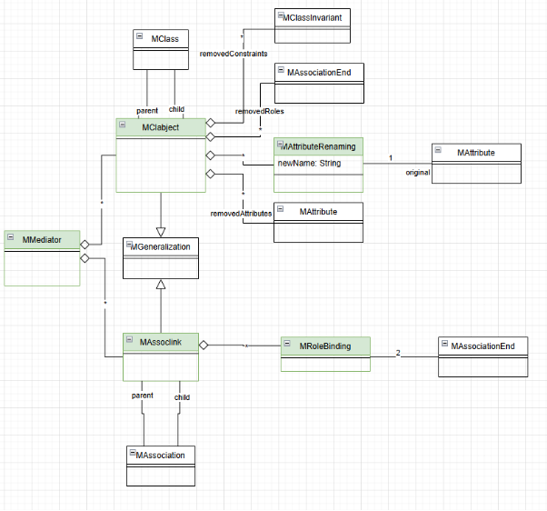

**MClabject:**

The declaration of a clabject consists of 2 identifiers of classes, the first class must be in the current level, and the second class must be in the previous level.

The way we implemented clabject is based on the inheritance relationship (implemented as MGeneralization), but with some changes, so instead of just inheriting all the attributes, roles, and constraints, there is an option to inherit just some of the elements

**Generalization graph - gen graph data structure**

Since clabjects specify semantic interrelationship with partial inheritance features between classes, and assoclinks specify overriding relationship between associations, they are all added to the gen graph data structure. this way, when calculating the attributes of a class, the information from the clabject is taken into account,

Important usages of the gen graph can be seen at:

- allAttributes()
- navigableEnds()

in MInternalClassImpl.java

**allAttributes():**

Instead of simply accumulating all the attributes from the superclasses as done in MClassImpl, we have to look at the type of edge that connects the current class to the superclass, and if that edge is of type MClabject, then there are additional checks that need to be made for removing and renaming.

**navigableEnds():**

Similarly, for calculating the roles that are accessible from a class, instead of simply inheriting all the roles from the superclasses, we need to check if the edge is of type MClabject, and we check if a role was removed.

**MInternalClassImpl:**

Additional methods were overridden to handle clabject inheritance properly, This class could use some refactoring since it has 2 roles, wherein each one it acts differently:

- During the generation process of an mlm in the process of generating each model, the class has to act as if it’s the only class within the model.
- After the model is generated and added to the mlm, the class has to go through the mlm instead of the regular model to find out about its relationships.

**MInternalAssociationImpl:** 

Created to override a method called isAssignableFrom, which is used by the GUI when creating new links between objects, and we had to add additional checks for role removal.

**MInternalClassInvariant:**

This Class is used to override the calculateExpandedExpression method of the MClassInvariant class.

**MLMSystem:**

**MSystemState:**

Checking of well-definedness is placed here as well as an override for the method validateBinaryAssociations, which had to involve additional checks for whether a role was removed or not.

**MLMSystem:**

needed to override the method createLink, we had to add additional checks since the role the link was trying to connect to could have been removed.

ExpAllInstancesForInv:

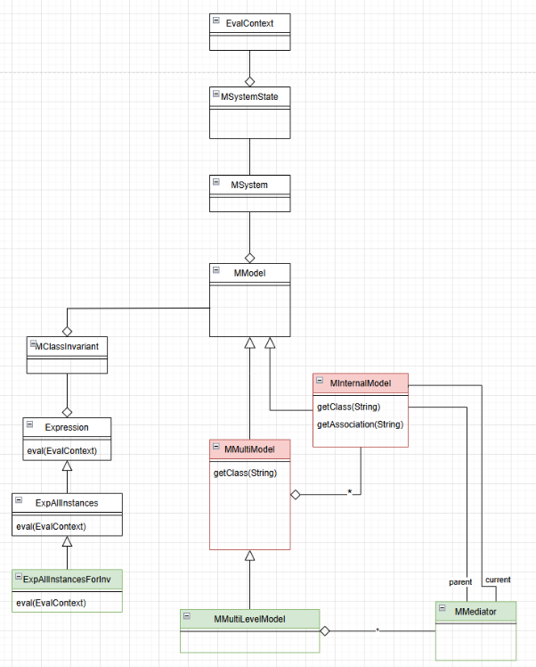

**How Constraint Validation Works**

When parsing a model, an expanded expression of allInstances->forAll is created for each constraint. This means an ExpForAll expression is generated, containing a range of values and an operation to apply to each value. The range of values is represented by an ExpAllInstances expression, while the operation corresponds to the body of the constraint. The ExpForAll expression serves as the root for all sub-expressions evaluated in the constraint.

When calling the checkState function, after verifying the structure (such as checking for duplicate relationships), the constraint validation process begins. For each constraint, its expanded expression is retrieved, and all expressions are collected into a list.

At this stage, the evaluation is handed over to a class called Evaluator. This class supports multi-threading, meaning it can compute multiple expressions in parallel, although in practice, it typically uses only a single thread. For each expression, a Job is created, and a Worker thread performs the computation. During the evaluation, the eval function in the Evaluator class is called, receiving the expression to compute and the MSystemState. The MSystemState is used to create an EvalContext, a helper class in the evaluation process that contains the MSystemState and variable bindings. Then, the eval function of each expression is called with the evalContext.

There are a total of 45 types of expressions.

Let's focus on the ExpForAll expression:

The first call to eval is made on ExpForAll, initiating the computation process:

- Compute the range on which the operation should be performed, meaning it retrieves the objects.
- For each object in the range, compute the expression in the body.

This means that in the first step, eval is called on ExpAllInstances, which works as follows:

The function objectsOfClassAndSubClasses in the MSystemState class is called.

This function receives a class and returns all objects of that class as well as objects of all its subclasses.

**The Problem**

If a constraint has been removed in ClassObject (i.e., inheritance removes a constraint), we don't want objects of that class to be included in the list returned by ExpAllInstances.

**Our Solution**

We introduce a new type of expression, ExpAllInstancesForInvariant, which behaves similarly to ExpAllInstances but keeps a reference to the constraint that created it. During computation, when returning the list of objects, it checks whether the constraint was overridden in the inherited classes.

**Code Changes:**

Added a class which inherits from MClassInvariant called MInternalClassInvariant that creates ExpAllInstancesForInvariant instead of ExpAllInstances.

## 6.4. Testing of MLM:
Testing is done in the following classes:

- MLMCreationTest.java
- USECompilerMLMSimple.java
- USECompilerMLMTestComplex.java

## 6.5. System analysis support: static analysis [TODO]

# 7. Miscellaneous

## 7.1. How to Release a New Version
1. Run ‘mvn package’
2. navigate to ‘\use-assembly\target\’ and grab ‘use-7.x.x.zip’ and ‘use-7.x.x.tar.gz’
3. Publish these files to wherever you’d like

## 7.2. Model Validator Plugin

The current state of the Model Validator Plugin is described in the following link:
https://github.com/Gil4390/useBGU/tree/MLM-USE/use-core/src/test/resources/org/tzi/use/mlmPlugin

The table in the link above explains what MLM-USE features work with the plugin and which ones don't, along with tests that pinpoint the exact issue.

We had a few tries of modifying the base code of the plugin, as it is a bit outdated, but with no major success. The plugin is built around a specific implementation of USE, so changing parts of USE or adding new features (as we did in MLM-USE), causes it to act unexpectedly.

The changes that we made to the plugin can be found in the following repo:
https://github.com/amielsaa/use_plugins_bgu

explanation on how to run and use the plugin, can be found in the user manual in section 4.2:
https://github.com/Gil4390/useBGU/blob/MLM-USE/documentation/MLM-Documentation/user-manual.md

## 7.3. How to Add Plugins to Dev Environment:
1. In the directory: ‘\use-core\target’, create a new directory named ‘lib’, inside lib create another directory named ‘plugins’. The path should look like so: ‘\use-core\target\lib\plugins’
2. Inside this directory, drop the JAR files of the plugins
