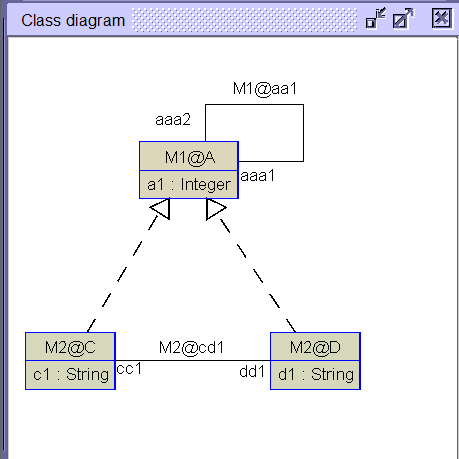

The following example demonstrates a use case for assoclink.

Class A in model M1 has a self association, 

in M2 classes C and D are defined as clabjects of A, and the association cd1 is defined as ana assoclink of the self assocation of A

    MLM ABCD

      model M1
        class A
          attributes
            a1: Integer
        end

        association aa1 between
          A[*] role aaa1
          A[*] role aaa2
        end

      model M2
        class C
          attributes
            c1: String
        end

        class D
          attributes
            d1: String
        end

        association cd1 between
          C[*] role cc1
          D[*] role dd1
        end

    mediator M1 < NONE
    end

    mediator M2 < M1
      clabject C : A
      end

      clabject D : A
      end

      assoclink cd1 : aa1
          aaa1->cc1
          aaa2->dd1
      end

    end

