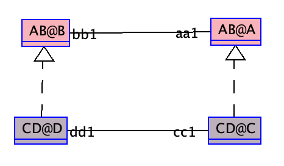

The following example demonstrates how assoclink can be used to override inheritance of roles.

When defining an assoclink, all inherited roles associated with the parent association of the assoclink, wont be inherited by default or by renaming. 

In the current example, class 'C' wont inherit role 'bb1' because we defined an assoclink 'cd1' of 'ab1'.

Therefore, the current roles of class 'C' and 'D':

    CD@C.roles = { 'dd1 : CD@D' }
    CD@D.roles = { 'cc1 : CD@C' }

If we add a role renaming to clabject 'C : A', as the following:

    clabject C : A
        roles
            aa1 -> jj1
    end

role 'jj1' wont be inherited, and the roles will be the same as stated above.

    MLM ABCD

      model AB
        class A
        end
    
        class B
        end

        association ab1 between
          A[*] role aa1
          B[*] role bb1
        end

      model CD
        class C
        end
    
        class D
        end
    
        association cd1 between
          C[*] role cc1
          D[*] role dd1
        end

    mediator AB < NONE
    end
    
    mediator CD < AB
        clabject C : A
        end
    
        clabject D : B
        end
    
        assoclink cd1 : ab1
            aa1 -> cc1
            bb1 -> dd1
        end
    
    end
