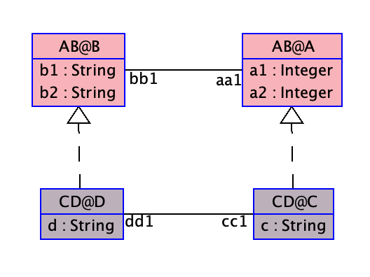

The following example, asserts that renamed attributes
can be accessed through inter-constraints.

Clabject 'C' of class 'A' have a renamed attribute 'a1 --> c5'.

Therefore, we can use 'c5' in inter-constraint 'i1'.

We can do a sanity check that the breaking point of the constraint does work, by following the commands below:

makes 'i1' <b>UNSATISFIABLE</b>:
```
  !create c:CD@C
  !create b:AB@B
  !insert (c, b) into AB@ab1
  !set c.c5 := 3
```
makes 'i1' <b>SATISFIABLE</b>:
```
  !set c.c5 := 10
```



