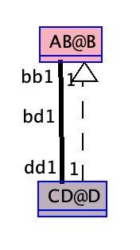

The following example, demonstrates a way to solve a multiplicity conflict caused by an inherited role 'dd1 : CD@D'.

The current '.use' file will have a multiplicity constraint failure, to inspect the conflict, do the following:

1. Load the '.use' file that is located in the current directory.
2. Run the following commands in the console:
```
  !create b1:AB@B
  !create d1:CD@D
  !insert (b1, d1) into bd1
  check
```


Adding the following lines of role removal to clabject 'D : B' will fix this multiplicity constraint failure:

```
roles
  ~dd1
```





```
MLM ABCD

  model AB

    class B
    end

  model CD

    class D
    end

inter-associations
association bd1 between
      AB@B[1] role bb1
      CD@D[1] role dd1
end


mediator AB < NONE
end

mediator CD < AB

   clabject D : B
   end

end

```


