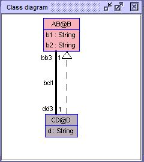

The following example, demonstrates a way to solve a conflicted role names by using role removal through a clabject.

Clabject 'D' of class 'B' has a role removal of 'r : CD@D' through the inter-association 'bd1'.

Therefore, Clabject 'D : B' doesnt inherits 'r' and prevents role duplication conflict.

Class 'D' roles <b>before</b> removal: ```'r : AB@B', 'r : CD@D'```

Class 'D' roles <b>after</b> removal: ```'r : AB@B'```




```
MLM ABCD

  model AB

    class B
    end

  model CD

    class D
    end

inter-associations
association bd1 between
      AB@B[1] role r
      CD@D[1] role r
end


mediator AB < NONE
end

mediator CD < AB

   clabject D : B
        roles
            ~r
   end

end


```


