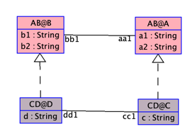

The following examples demonstrates how to rename a role.

Clabject 'C' of class 'A' has a role 'bb1' through the association 'ab1'.
We can rename that role to 'bb3', by adding the following line: 'bb1 -> bb3' under the 'roles' segment in clabject 'C'.
--> 'oldRoleName -> newRoleName' oldRoleName corresponds to the parent role.

    MLM ABCD
    
    model AB
    class A
      attributes
        a1: String
        a2: String
    end

    class B
      attributes
        b1: String
        b2: String
    end

    association ab1 between
      A[*] role aa1
      B[*] role bb1
    end

    model CD
    class C
      attributes
        c: String
    end

    class D
      attributes
        d: String
    end

    association cd1 between
      C[*] role cc1
      D[*] role dd1
    end

    mediator AB < NONE
    end
    
    mediator CD < AB
        clabject C : A
          roles
            bb1 -> bb3
    end
    
    clabject D : B
    end
    
    end
