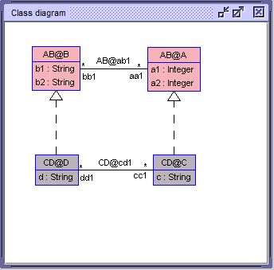

The following example, asserts that renamed roles
can be accessed through inter-constraints.

Clabject 'C' of class 'A' have a renamed role 'bb1 --> bb5' through association 'ab1'.

Therefore, we can use 'bb5' in inter-constraint 'i1'.

We can do a sanity check that the breaking point of the constraint does work, by following the commands below:

makes 'i1' <b>UNSATISFIABLE</b>:
```
  !create c:CD@C
  !create b:AB@B
  !insert (c, b) into AB@ab1
```
makes 'i1' <b>SATISFIABLE</b>:
```
  !set b.b1 := 'b'
```



