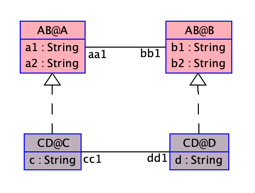

The following example demonstrates how to define an assoclink.

An assoclink must be associated with an association, that both ends have a defined clabject.

Assoclink 'cd1' of association 'ab1', needs to have a role binding.
We can bind each parent role to the child role by adding the following lines under the assoclink segment :
'aa1 -> cc1'
'bb1 -> dd1'
--> 'parentRoleName -> childRoleName' denotes role binding.
--> parentRoleName corresponds to the role of the parent clabject ('A.aa1').
--> childRoleName corresponds to the role of the child clabject ('C.cc1').

    MLM ABCD

    model AB
    class A
      attributes
        a1: String
        a2: String
    end

    class B
      attributes
        b1: String
        b2: String
    end

    association ab1 between
      A[*] role aa1
      B[*] role bb1
    end

    model CD
    class C
      attributes
        c: String
    end

    class D
      attributes
        d: String
    end

    association cd1 between
      C[*] role cc1
      D[*] role dd1
    end

    mediator AB < NONE
    end
    
    mediator CD < AB
    clabject C : A
    end

    clabject D : B
    end

    assoclink cd1 : ab1
        aa1 -> cc1
        bb1 -> dd1
    end
    end
