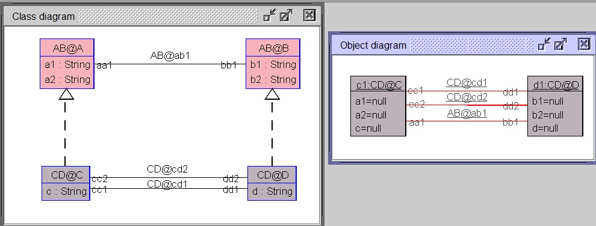

The simplest case for defining a clabject acts the same as defining an inheritance relationship between the classes

in this example we can see that class C inherits all the attributes from class A

    MLM ABCD

    model AB
        class A
            attributes
                a1: String
                a2: String
        end
        
        class B
            attributes
                b1: String
                b2: String
        end
    
        association ab1 between
            A[*] role aa1
            B[*] role bb1
        end
    
    
    model CD
        class C
            attributes
                c: String
        end
    
        class D
            attributes
                d: String
        end
    
        association cd1 between
            C[*] role cc1
            D[*] role dd1
        end
    
        association cd2 between
          C[*] role cc2
          D[*] role dd2
        end
    
    
    mediator AB < NONE
    end
    
    mediator CD < AB
        clabject C : A
        end
        
        clabject D : B
        end
    end
